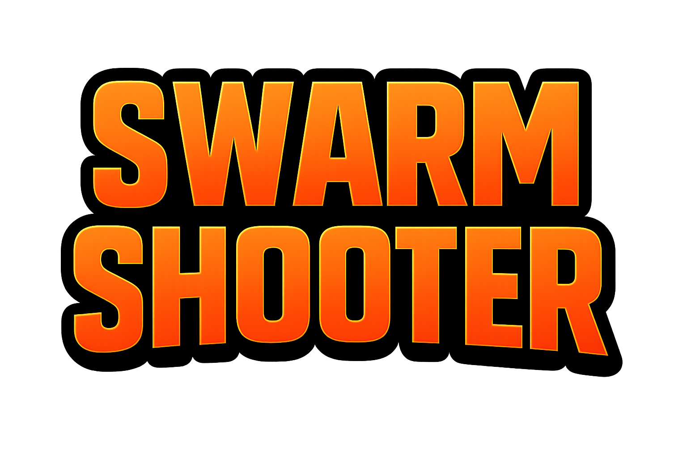

<!-- BANNER -->

  

<h1 align="center">A Third-Person Survival Shooter Prototype</h1>

  <a href="YOUR_BUILD_LINK">▶️ Play Game</a> •
  <a href="YOUR_TRAILER_LINK">🎥 Trailer</a>

  
  
  
  

---

## 👋 Introduction

This repository showcases a **personal Unity project** developed within a short timeframe at VTC Academy.

I worked as a **Gameplay Programmer**, focusing on building a responsive **third-person shooter experience** with scalable gameplay systems.

Core implementations include:

* Player and enemy behavior using FSM
* Shooting system with multiple fire modes
* Enemy spawning and AI behavior
* Object pooling and performance optimization
* Roguelike-style buff system

> 🔍 This project highlights my ability to quickly prototype gameplay systems, apply common patterns, and optimize player experience under time constraints.

> ⚠️ Due to limited development time, this project focuses primarily on gameplay systems rather than visual polish.

---

## 📅 Development Timeline

* Development period: [Add time - e.g. 1–2 weeks]
* Team size: Solo project

This project was developed in a short time, prioritizing **core gameplay feel and system implementation** over content and visual quality.

---

## 📚 Table of Contents

* [About The Project](#-about-the-project)
* [Gameplay Preview](#-gameplay-preview)
* [Key Features](#-key-features)
* [My Contribution](#-my-contribution)
* [Technical Highlights](#-technical-highlights)
* [Tech Stack](#️-tech-stack)
* [What I Learned](#-what-i-learned)

---

## 📌 About The Project

This is a **third-person survival shooter prototype**, where the player fights waves of enemies that increase in difficulty over time.

* Genre: Survival Shooter
* Role: Gameplay Programmer (Solo)
* Focus: Combat systems, AI behavior, and performance optimization

Core gameplay loop:

* Fight continuously spawning enemies
* Survive as long as possible
* Gain buffs to enhance player power
* Increasing difficulty over time

(<a href="#readme-top">back to top</a>)

---

## 🖼️ Gameplay Preview

<!-- Add your GIFs or gameplay images here -->

  

---

## ✨ Key Features

* **Third-Person Shooting System**

  * Shooting from weapon muzzle toward crosshair
  * Improves realism and aiming consistency

* **Weapon System**

  * Multiple fire modes:

    * Automatic
    * Burst (3 shots)
    * Grenade launcher

* **Player Animation System**

  * Upper-body aiming using Avatar Mask
  * Rotation constraints with lower-body follow for realism

* **Enemy AI (FSM)**

  * State-based behavior (chase, attack, etc.)
  * Pathfinding with obstacle avoidance

* **Enemy Spawn System**

  * Enemies spawn outside camera view
  * Prevents immersion-breaking pop-in

* **Roguelike Buff System**

  * 10+ different buffs
  * Enhances player stats and gameplay variation

* **Difficulty Scaling**

  * Game becomes progressively harder over time

* **Performance Optimization**

  * Object Pooling for enemies and bullet impacts

* **Audio System**
  
  * Integrated sound effects for shooting, impacts, and gameplay feedback

(<a href="#readme-top">back to top</a>)

---

## 👤 My Contribution

This is a **solo project**, and I was responsible for all gameplay systems.

### Gameplay Systems

* Third-person shooting system (muzzle → crosshair)
* Weapon system with multiple firing modes
* Roguelike-style buff system

### AI & Spawning

* Enemy AI using Finite State Machine (FSM)
* Pathfinding and obstacle avoidance
* Smart spawning system outside camera view

### Animation & Control

* Avatar Mask for upper-body aiming
* Character rotation constraints for realistic movement

### Optimization

* Object pooling system for enemies and bullet impacts

> 💡 Focus: Rapid implementation of gameplay systems with attention to player experience and performance.

(<a href="#readme-top">back to top</a>)

---

## 🧠 Technical Highlights

* **Finite State Machine (FSM)**
  * Used for both player and enemy behaviors

* **Singleton Pattern**
  * Used for managing core global systems (e.g. game flow, audio)

* **Object Pooling**
  * Reduces runtime instantiation cost
  * Improves performance during combat

* **Enemy Spawn System**
  * Enemies spawn outside camera view
  * Designed to avoid visible enemy pop-in by spawning outside camera frustum

* **Animation Layering**
  * Avatar Mask for independent upper-body aiming

---

## 🛠️ Tech Stack

* Unity
* C#
* Animator / Avatar Mask

---

## 🧠 What I Learned

* Rapid prototyping under time constraints
* Building responsive shooter mechanics
* Designing enemy AI using FSM
* Improving player experience through spawn logic
* Applying performance optimization techniques

---

## ⭐ Support

If you find this project interesting, feel free to give it a ⭐!
